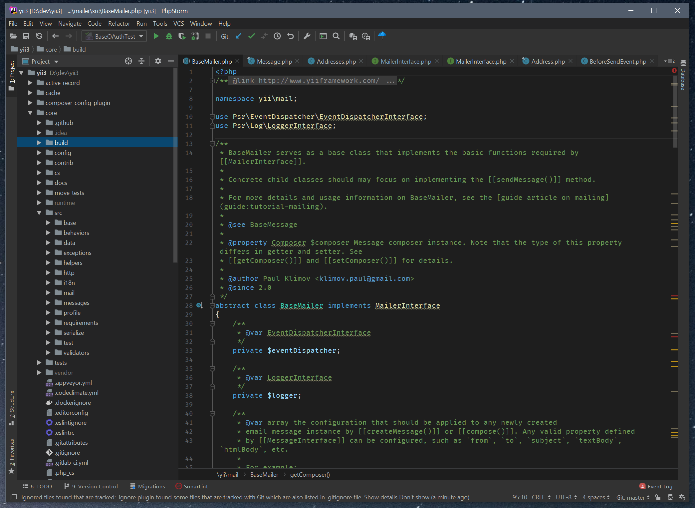

# Visual Studio Code Dark Plus theme for JetBrains IDEs

A theme for JetBrains IDEs inspired by default Visual Studio Code "Dark Plus" theme.

## Screenshot

That is how it looks with Fira Code font in IDEA:

And here is PhpStorm:

## Installation

1. Install "Visual Studio Code Dark Plus Theme" plugin
2. Select theme in Settings → Appearance & Behavior → Appearance → Theme
